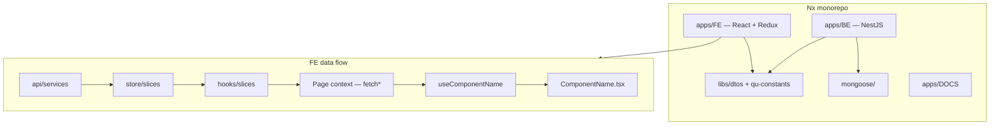

# quack-auth

A full-stack authentication module — sign up, sign in, and quack your way in. Built with **React**, **NestJS**, **MongoDB**, and **Zod** in an **Nx** monorepo.

## What’s in the repo

| Area        | Path                              | Notes                                                                    |
| ----------- | --------------------------------- | ------------------------------------------------------------------------ |
| Frontend    | `apps/FE`                         | React + Vite + Tailwind                                                  |
| Backend     | `apps/BE`                         | NestJS, Swagger at `/docs`, Zod validation, API tests (Jest + Supertest) |
| Docs site   | `apps/DOCS`                       | Docusaurus — setup guides, app notes, AI policy                          |
| Shared libs | `libs/dtos`, `libs/qu-constants`  | `@shared/dtos`, `@shared/constants`                                      |
| MongoDB     | `mongoose/`, `docker-compose.yml` | Mongoose client, models, local Docker DB                                 |

For architecture details, setup walkthroughs, path aliases, nestjs-zod wiring, and AI workflow — see the **documentation site** (below).

## Architecture (high level)



## Prerequisites

- **Node.js** 22.13+ (required by pnpm 11.5.2)
- **pnpm** 11.5.2 (`packageManager` is pinned in `package.json`)
- **Docker** (optional, for local MongoDB via `docker compose`)

## Getting started

```bash
# Install dependencies
pnpm install

# Copy environment template and adjust if needed
cp .env.example .env
```

## Docker Compose (dev services)

Local infrastructure lives in root `docker-compose.yml`. Copy env first (`cp .env.example .env`).

```bash
# MongoDB (required for BE auth against a real DB)
docker compose up -d mongodb

# Optional: Seq log UI for browsing structured BE logs (dev only)
docker compose up -d seq
```

| Service | URL / port            | Env / notes                                                                |
| ------- | --------------------- | -------------------------------------------------------------------------- |
| MongoDB | `localhost:27017`     | `MONGODB_URI`, `MONGODB_DATABASE` in `.env` (defaults match compose creds) |
| Seq     | http://localhost:5341 | No BE env required for local pretty logs; Seq is optional log browsing     |

**How apps connect**

- **BE** — reads `MONGODB_URI` + `MONGODB_DATABASE` from `.env`; `DatabaseModule` (`@nestjs/mongoose`) connects on boot. API: http://localhost:3000/api (Swagger: `/docs`).
- **FE** — `VITE_API_URL=http://localhost:3000/api` (see `.env.example`); browser calls BE with credentials for cookie auth.
- **Seed data** — `pnpm db:seed` after Mongo is up (fixtures in `mongoose/fixtures/`).

```bash
docker compose ps
docker compose logs mongodb
docker compose down   # stop services (volumes persist)
```

Run apps:

```bash
pnpm nx serve FE      # http://localhost:4200
pnpm nx serve BE      # http://localhost:3000/api  (Swagger: /docs)
pnpm nx serve DOCS    # http://localhost:4001
```

## Tests

**BE API tests** — Jest + Supertest against the real Nest app (in-memory Mongo, shared fixtures from `mongoose/fixtures/`):

```bash
pnpm test:be          # alias for pnpm nx test BE
pnpm nx test BE
```

Specs live in `apps/BE/src/test/api/**/*.api-spec.ts`. See **DOCS → Apps → Backend → Testing** (`pnpm nx serve DOCS` → http://localhost:4001/apps/be/testing) for layout, fixtures, and error-message conventions.

## Documentation

**Full docs live in the Docusaurus app** — not in this README.

```bash
pnpm nx serve DOCS
```

Then open http://localhost:4001 for setup steps, per-app guides (FE, BE, MongoDB), and AI-first engineering policy.

## Quality checks

Pre-commit hooks (Husky) auto-fix staged files with **Prettier** and **ESLint**, then run the full check suite:

```bash
pnpm check          # lint + typecheck + format:check
pnpm lint           # ESLint (all Nx projects)
pnpm lint:fix       # ESLint with --fix
pnpm typecheck      # tsc --noEmit (apps, libs, mongoose/)
pnpm format         # Prettier write
pnpm format:check   # Prettier check
```

**CI** (`.github/workflows/ci.yml`) runs **`pnpm ci`** (`pnpm check` + **`pnpm build`** + **`pnpm nx test BE`**) on push/PR. Husky pre-commit stays on `pnpm check` only — builds and tests are too slow for every commit. On **PR opened**, `.github/workflows/pr-open-change-summary.yml` runs the Cursor agent (read-only) and appends a change digest to the PR description — see [Setup → Husky & quality gates](http://localhost:4001/setup/09-husky-quality-gates) (`pnpm nx serve DOCS`). FE E2E is not in CI yet.

### GitHub Actions secrets (maintainers)

The PR digest workflow needs a **Cursor API key** in the repository (not in `.env`):

| Secret           | Purpose                                                                  |
| ---------------- | ------------------------------------------------------------------------ |
| `CURSOR_API_KEY` | Cursor agent CLI auth for `.github/workflows/pr-open-change-summary.yml` |

The Developer has added **`CURSOR_API_KEY`** under **Settings → Secrets and variables → Actions**. Clone/local dev does not need this secret unless you run the agent workflow yourself. Optional repo **variables**: `CURSOR_SUMMARY_MODEL`, `CURSOR_AGENT_PACKAGE_VERSION` — see DOCS.

## Keeping DTOs in sync (`libs/dtos` ↔ feature `*.dto.ts`)

Shared Zod schemas live in `libs/dtos`; NestJS needs separate `createZodDto` wrappers colocated with controllers (e.g. `apps/BE/src/controllers/users/users.dto.ts`). That pairing is easy to forget — see the sync warning in **Setup → nestjs-zod** (`pnpm nx serve DOCS` → http://localhost:4001).

The Developer maintains **[filelinks](https://github.com/Vilancer/filelinks)** — a tool that declares semantic links between files (and directories). On `filelinks check`, staged **triggers** flag missing **affects** companions; with **`--run-agents`**, it can spawn a Cursor agent (configured prompt/model per link) to fix them — e.g. update feature `*.dto.ts` after `libs/dtos` changes. The upstream README shows `pnpm add -D filelinks @filelinks/core`, but **it is not published on npm yet** — use the GitHub repo until release.

## Git workflow (multi-chat / Agents)

Each Cursor chat uses its own branch: **`quack-XX-<feature>`** (e.g. `quack-01-auth-login`). Start with:

```bash
./scripts/next-quack-branch.sh <feature-slug>
```

Commits use **Conventional Commits** (`feat:`, `fix:`, `docs:`, `test:`, …) — enforced by commitlint + Husky. Details in DOCS → **Setup → Git branches & commits**.

## AI-assisted development

This repo uses an AI-first workflow. See `AI.md` for session log and `.cursor/agents/` for subagents. Policy and doc conventions are in the DOCS app under **AI**.
